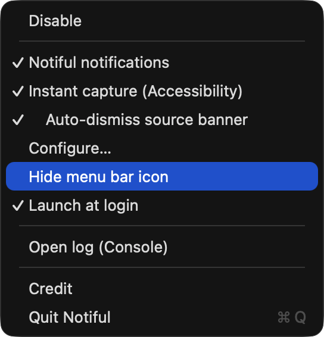
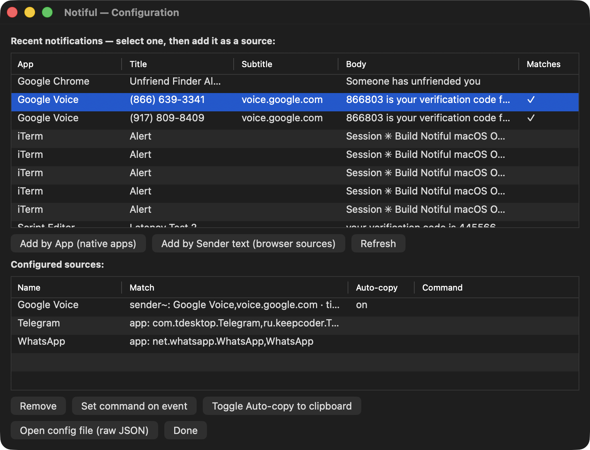

# Notiful

A tiny **local-only** macOS menu-bar app that pulls one-time passcodes (2FA / verification codes) out of your notifications so you can copy them with one click — and, if you like, run a shell command on each code.

macOS only autofills codes from its own Messages and Mail. Codes that arrive any other way — **Google Voice** in the browser, **Telegram**, **WhatsApp**, banking apps — show up as notifications you have to read and retype. Notiful reads them for you.

- 🔒 **No network. Ever.** Everything happens on your Mac.
- 🪶 **No dependencies.** Pure Swift + Apple frameworks.
- 🧭 Lives in the menu bar — no Dock icon, no window in your way.

---

## Screenshots

| A detected code (click to copy) | The menu | Add sources visually |
|---|---|---|
|  |  |  |

---

## Install

> Universal (Apple Silicon + Intel), macOS 13+. Notiful is signed with a **Developer ID** certificate
> and **notarized by Apple**, so it opens normally — no Gatekeeper bypass needed. It makes **no
> network calls** — every line of source is in this repo.

### Homebrew (recommended)

```sh
brew tap ptrinh/notiful https://github.com/ptrinh/Notiful
brew install --cask notiful
open -a Notiful
```

Later: `brew upgrade --cask notiful` to update, `brew uninstall --cask notiful` to remove
(add `--zap` to also delete your settings).

### Manual download

1. Download **`Notiful.zip`** from the [latest release](https://github.com/ptrinh/Notiful/releases/latest).
2. Unzip and move **Notiful.app** to **/Applications**.
3. Double-click to open (`open -a Notiful`).

---

## First-run setup

1. A 🔑 icon appears in the menu bar and a welcome popup explains the next step.
2. **Grant Full Disk Access** (Notiful needs it to read the notification database):
   **System Settings → Privacy & Security → Full Disk Access → add/enable Notiful**, then relaunch.
   Until you do, the icon shows a ⚠️ and Notiful posts a notification linking you to the right pane.
3. Open **Sources & advanced settings…** from the menu and pick which notifications to watch
   (defaults for Google Voice, Telegram and WhatsApp are already included).
4. **Important:** to avoid seeing *two* banners per code, mute the source app's own banner —
   see [Stop double banners](#stop-double-banners) below.

That's it for everyday use. The sections below cover faster capture, Google Voice, and advanced options.

---

## Using Notiful

Click the 🔑 icon for the menu:

- **Status line** (top) — shows whether Notiful is watching, how many sources, and the last code captured.
- **Pause / Resume watching** — temporarily stop or restart detection.
- **Settings**
  - **Show a banner when a code is found** — post Notiful's own clickable banner (click it to copy).
  - **Instant capture** — sub-second capture; see [Instant capture](#instant-capture-optional).
  - **Launch at login** — start Notiful automatically.
- **Sources & advanced settings…** — the visual editor (below).
- **Open Notiful's log…**, **Grant Full Disk Access…**, **Hide menu bar icon…**, **About**, **Quit**.

### Adding & editing sources

Open **Sources & advanced settings…**. The top table lists your **recent notifications** — pick one and:

- **Add this app** — watch everything from that app (best for native apps like Telegram/WhatsApp).
- **Add by matching text…** — watch notifications whose title/subtitle contains text you specify
  (best for browser sources like Google Voice).

For a source you're already watching, select it and use **Edit…** (rename or fix the matching text),
**Auto-copy on/off**, **Run command…**, or **Remove**. No JSON required — though **Edit raw config (JSON)**
is there if you want it.

---

## Stop double banners

You **can't** redirect another app's notification — whoever posts it owns the click. So Notiful posts
its *own* banner, and you mute the source app's banner so you only see one.

For each source app, go to **System Settings → Notifications → \<the app\>** and:

- **Allow Notifications: ON** ← keep this on, or the code never reaches Notiful.
- **Uncheck "Desktop"** — this is the on-screen banner you want to hide.
- **Notification Center: ON** — keeps the code flowing to the database Notiful reads.

(On macOS 15/26 there's no "None" style — the on-screen banner *is* the **Desktop** checkbox.)

> **Why codes appear a few seconds later:** macOS holds a notification in memory (~5s) before writing
> it to the database Notiful reads. Hiding the "Desktop" banner removes the duplicate but doesn't
> change this delay — it's inherent to the database approach. For instant copies, turn on
> [Instant capture](#instant-capture-optional).

---

## Instant capture (optional)

**Instant capture** reads the banner straight off the screen via the macOS Accessibility API the moment
it appears — no ~5s database delay. The database watcher stays on as a fallback.

Turn it on from the menu, then grant **Accessibility** in
**System Settings → Privacy & Security → Accessibility** (it starts working automatically once granted).

- The source app's banner **must stay visible** (don't hide its "Desktop" banner) — there has to be a
  banner on screen to read. Toggle **Auto-hide the original banner after capture** so you still end up
  seeing only Notiful's banner.
- Matching here is **text-based**, so it covers sources matched by text (e.g. Google Voice). Apps matched
  only by bundle id (Telegram, WhatsApp) still come through the database fallback.
- Codes are still never written to disk.

---

## Google Voice setup

Google Voice has no Mac app — it runs in Chrome, which by default files all web notifications under
"Google Chrome", so you can't mute *just* Google Voice. Install it as its own app:

1. **Install as an app** — in Chrome, open **voice.google.com**, then **⋮ → Cast, Save, and Share →
   Install page as app…** (or the install icon in the address bar).
2. **Enable PWA notification attribution** — open
   `chrome://flags/#enable-mac-pwas-notification-attribution`, set it to **Enabled**, then fully quit
   and reopen Chrome (the flag only applies on a fresh launch).
3. **Use the app, not a tab** — close any `voice.google.com` tab, then open the **Google Voice** app
   from Launchpad and allow notifications.
4. **Mute its banner** — trigger one code so macOS registers the app, then under
   **System Settings → Notifications → Google Voice**: Allow Notifications **ON**, uncheck **Desktop**,
   Notification Center **ON**.

The built-in `voice.google.com` rule already matches it. The same pattern works for any browser source.

---

## Advanced

<details>
<summary><b>Run a command when a code arrives</b></summary>

Each source can run a shell command on detection (set it via **Run command…**, or `actions.runCommand`
in the config). The notification text and code are passed as **environment variables** (never
interpolated into the string — avoids injection):

`NOTIFUL_CODE`, `NOTIFUL_SOURCE`, `NOTIFUL_APP`, `NOTIFUL_TITLE`, `NOTIFUL_SUBTITLE`, `NOTIFUL_BODY`

```json
"actions": { "runCommand": "echo \"$NOTIFUL_SOURCE: $NOTIFUL_CODE\" >> ~/otp.log" }
```

⚠️ This runs arbitrary shell code with your privileges — only put commands you trust here.
</details>

<details>
<summary><b>config.json reference</b></summary>

`~/Library/Application Support/Notiful/config.json` — created with sensible defaults on first run.
Edit it visually via **Sources & advanced settings…**, or open the raw JSON from there. Any omitted key
falls back to its default.

```jsonc
{
  "defaultOTPRegex": "\\b(\\d{4,8})\\b",   // global fallback; smart extraction runs first
  "clipboardAutoClearSeconds": 0,           // 0 = never auto-clear
  "pollIntervalSeconds": 15,                // fallback poll / watch debounce
  "sources": [ /* … */ ]
}
```

**A `source` has:**

| field      | meaning |
|------------|---------|
| `name`     | label shown in the notification & menu |
| `match`    | how to recognise it (below). Matches when **any** positive criterion hits. |
| `otpRegex` | *(optional)* per-source regex override (capture group 1 = the code) |
| `actions`  | `autoCopy`, `showActionableNotification`, `openButton`, `openTarget`, `runCommand` |

**`match` options** (any one is enough):

- `appBundleIds` — apps that posted it (case-insensitive). **Use for native apps.**
- `senderContains` — substring of the title **or subtitle**. **Use for browser sources.**
- `titleContains` — substring of the title only.
- `bodyContains` — *(optional gate)* the body must also contain one of these.

**`actions`:**

- `autoCopy` *(default `false`)* — copy the instant a code arrives, not just on click.
- `showActionableNotification` *(default `true`)* — post Notiful's clickable banner.
- `openButton` / `openTarget` — add an "Open Source" button; target is a URL
  (`https://voice.google.com`) or a bundle id (`com.tdesktop.Telegram`).

**Examples (these ship as defaults):**

```json
{ "name": "Google Voice",
  "match": { "senderContains": ["Google Voice", "voice.google.com"] },
  "actions": { "openButton": true, "openTarget": "https://voice.google.com" } }

{ "name": "Telegram",
  "match": { "appBundleIds": ["com.tdesktop.Telegram", "ru.keepcoder.Telegram"] },
  "actions": { "openButton": true, "openTarget": "com.tdesktop.Telegram" } }

{ "name": "WhatsApp",
  "match": { "appBundleIds": ["net.whatsapp.WhatsApp"] },
  "actions": { "openButton": true, "openTarget": "net.whatsapp.WhatsApp" } }
```

Find an app's bundle id: `osascript -e 'id of app "Telegram"'`.
</details>

<details>
<summary><b>Headless / scripted use</b></summary>

```sh
Notiful.app/Contents/MacOS/Notiful --once
```

Scans the latest matching notification, copies the code, and prints a **masked** result
(e.g. `Google Voice · 6••••0 — copied to clipboard`). Exit `0` on a hit, `1` if nothing matched.
</details>

<details>
<summary><b>Build from source</b></summary>

Needs the Swift toolchain (Xcode **or** Command Line Tools — `xcode-select --install`).

```sh
./scripts/build-app.sh   # compiles a release binary and assembles a signed Notiful.app
open Notiful.app
```

Run the tests (dependency-free; works without full Xcode):

```sh
swift run NotifulTests
```
</details>

<details>
<summary><b>How it works</b></summary>

1. Locates the notification DB (`~/Library/Group Containers/group.com.apple.usernoted/db2/db`).
2. Copies it (+ WAL/SHM) to a temp dir and opens the copy **read-only** — avoids locking the live DB
   while still seeing just-delivered notifications.
3. Watches the WAL with a kqueue file monitor (event-driven, ~0% CPU idle), with a sparse safety-net
   timer. A cheap `mtime` check skips work when nothing changed.
4. Decodes each new record, runs it through your source matchers, and extracts the code
   (keyword-biased; rejects phone numbers, dates, and currency amounts).
5. De-dupes against a watermark + launch time so no code is acted on twice.
</details>

---

## Security

- **Local only — no network code exists.** Audit it: nothing imports URLSession/Network.
- Full Disk Access lets Notiful read **every** app's notifications, but it only acts on the sources you
  configure. The codebase is small and auditable — read `Sources/NotifulCore` before trusting it.
- **Codes are never written to disk** and are **masked everywhere** in logs (e.g. `6••••0`).
- **Click-to-copy by default** (`autoCopy` off), so your clipboard is only overwritten on intent.
- `clipboardAutoClearSeconds` clears the clipboard after a timeout — but only if it still holds that
  exact code.

---

## Uninstall

1. Quit Notiful (menu → **Quit**), and turn **Launch at login** off first if you enabled it.
2. Delete the app and its data:
   ```sh
   rm -rf /Applications/Notiful.app
   rm -rf "$HOME/Library/Application Support/Notiful"
   ```
3. Remove **Notiful** from **System Settings → Privacy & Security → Full Disk Access**
   (and **Accessibility**, if you enabled instant capture).
4. Restore any source apps' "Desktop" banners you muted.
</content>
</invoke>
